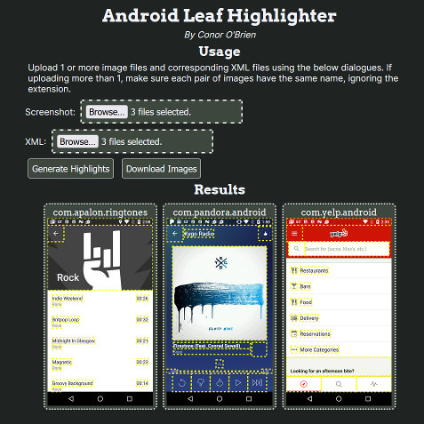

# CSCI535-Programming-Assignment



## How to run the website

- Available online here: https://conorobrien-foxx.github.io/CSCI535-Programming-Assignment/ (only tested with latest version of Firefox)
- Alternatively, run on `localhost` or similar; for example, with the following script:
```js
let connect = require('connect');
let serveStatic = require('serve-static');
const port = 8080;

const arg = process.argv[2] || "./";

connect().use(serveStatic(arg)).listen(port, function(){
    console.log(`Server running on localhost:${port}...`);
});

const readline = require('readline').createInterface({
  input: process.stdin,
  output: process.stdout
});

readline.question("\n------------------------------\nPress ENTER to quit\n------------------------------\n", (name) => {
    process.exit(0);
});
```

## How to use the website

Upload 1 or more image files and corresponding XML files using the provided image upload dialogues. Expects both XML and screenshots to bear the same name, extension notwithstanding. Once all files are uploaded, press "Generate Highlights" to begin the process of adding yellow boxes to the images. Once complete, results may be viewed, downloaded individually (Right Click > Save Image), or downloaded en masse via "Download Images".